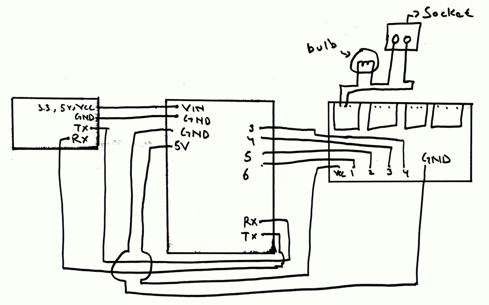

# 🔌 Mobile (Bluetooth) Controlled AC Light System

Control your home appliances like lights and sockets using a smartphone over Bluetooth. This smart home project leverages Arduino and relay modules to wirelessly switch AC devices on or off using an Android phone.

## 🧠 Overview

This project demonstrates how to:

- Interface an **HC-05 Bluetooth module** with an **Arduino UNO**
- Control **multiple AC appliances** via a **4/8-channel 5V relay module**
- Use a **Bluetooth terminal app** on Android to send on/off commands
- Safely switch **220V/120V AC devices** using low-voltage Arduino signals

## 📋 About the Project

When the user sends specific commands from their mobile device (via Bluetooth), the Arduino receives and interprets those commands, then activates or deactivates relays accordingly.

Each relay controls one AC load (like a bulb). The commands are simple characters like:

- `A` → Turn OFF relay 1
- `a` → Turn ON relay 1
- `B`, `b` → Relay 2 and so on...
- Every command is followed by `#` to signal completion

This system is ideal for DIY home automation beginners.

## 📁 Files

1. [`bluetooth_relay_control.ino`](bluetooth_relay_control.ino) – Arduino sketch for Bluetooth-controlled relay system
2. [`circuit.jpeg`](circuit-1536x960.jpeg) – Hand-drawn circuit diagram
3. [`README.md`](README.md) – Project documentation

## 📦 Dependencies

To run this project, you’ll need:

- **Arduino IDE** – to upload code
- **HC-05 Bluetooth module** – for wireless communication
- **Arduino Uno** – to control the relays
- **Relay Module (5V, 4/8 channel)** – to switch AC appliances
- **5V Adapter or power supply**
- **Android Phone with Bluetooth Terminal App** – e.g., [Bluetooth Terminal HC-05](https://play.google.com/store/apps/details?id=project.bluetoothterminal)
- **Jumper Wires**
- **AC Load** – light bulbs, sockets, etc.

## 📷 Circuit Diagram

- Left: Bluetooth Module
- Middle: Arduino UNO
- Right: 4-Channel Relay with bulb/socket connected
- Shared GND and power between modules

## ▶️ How to Use

1. **Upload** the code from `bluetooth_relay_control.ino` to your Arduino using the Arduino IDE.
2. **Connect** your components as shown in the circuit diagram.
3. **Power** your relay module with a 5V adapter (shared ground with Arduino).
4. **Pair** your Android phone with the HC-05 Bluetooth module.
5. **Open** the Bluetooth Terminal app and send commands:
   - `a` – Turn ON Relay 1
   - `A` – Turn OFF Relay 1
   - `b`, `B`, `c`, `C` ... for other relays
   - End each command with `#`

## ⚠️ Safety Note

> **Warning**: Working with 220V/120V AC is dangerous. Always take safety precautions:
>
> - Disconnect power when making changes
> - Use insulated wires and protective cases
> - If unsure, ask a qualified electrician to help

## 📚 Additional Resources

- [Arduino Official Documentation](https://www.arduino.cc/en/Guide/HomePage)
- [HC-05 Bluetooth Module Tutorial](https://howtomechatronics.com/tutorials/arduino/arduino-bluetooth-control-leds-hc-05/)
- [Relay Module Guide](https://randomnerdtutorials.com/guide-for-relay-module-with-arduino/)

## ▶️ Project Trailer

Watch the demo video to see the system in action:

- [Project Trailer](https://www.youtube.com/watch?v=dhyj6yaYwlc)  

  

## Author

Gulam Kibria Chowdhury 
Software Developer || Competitive Programmer 
Sylhet, Bangladesh 
Gmail: gkchowdhury101@gmail.com 
